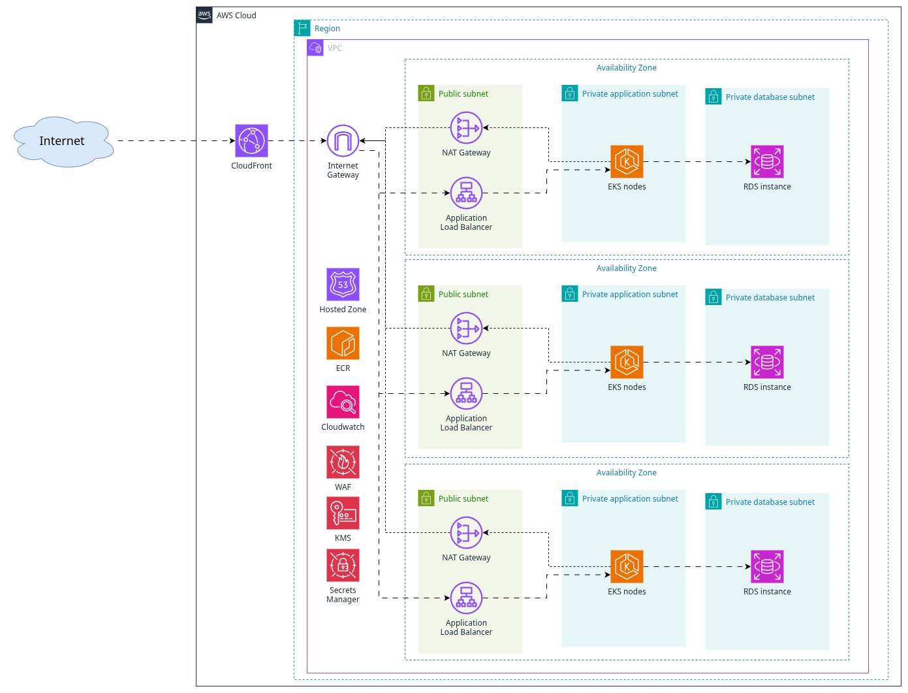

# Infra-challenge

## 1. Application

- The greeting application has been created using Python and FastAPI.
- In the current MVP, only an in-memory database has been implemented. In the future, the application code should be refactored to properly interact with an external DB (e.g. mysql, postgresql).
- For the sake of simplicity, the `routers/hello.py` file has been bloated not only with the FastAPI routers configuration but also with the app's business logic and the in-memory database implementation. In future iterations, this code should be refactored in order to properly separate concerns (e.g. a service layer and another one to access the data).

## 2. Helm chart

- The Helm chart assumes the following `Gateway` resource will be already provisioned by the cluster administrator:
  
  ```yaml
  apiVersion: gateway.networking.k8s.io/v1
  kind: Gateway
  metadata:
    name: public-gateway
  spec:
    gatewayClassName: nginx
    listeners:
      - name: http
        protocol: HTTP
        port: 80
        hostname: "*.local"
        allowedRoutes:
          namespaces:
            from: All
  ```

- Resources `requests` and `limits` have been defined for the application's Pod memory. Only `requests` has been defined for the Pod's CPU to prevent CPU throttling from sudden traffic peaks.

## 3. Architecture diagram



All the components included in the diagram could be deployed using Terraform, making sure the shared components are deployed separately from the application and developed in different Terraform stacks (Terraform projects).

### High Availability

This diagram reflects the approach that should be followed in order to deploy the application in High Availability, where multiple instances of the application Pod should be created and deployed across different EKS nodes (using Node Affinity configuration) ensuring these are also spread across Availability Zones. For the same reasons, there should be an RDS instance per zone and in a separated subnet to increase the security boundaries. In both cases, these resources will be deployed in private subnets with no direct access to the Internet.

NAT gateways are deployed across regions to also ensure high availability for egress traffic and EKS will be responsible to create the Load Balancers to expose the traffic to the Internet. These resources will be created in the public subnet with access to the Internet Gateway.

If the application needs to be globally accesible, we could replicate this setup in other regions in order to reduce the latency of the customers and to increase the resiliency of the system. If latency is not a problem, deploying a Failover copy of the setup (same cluster but without instances deployed) in another region could increase the resiliency in case the current region goes down, but due to the increase of costs, in order to implement this approach an analysis of the trade-offs of the availability vs. costs should be done first.

### Security

In order to prevent any DDoS or SQL injection attacks, a WAF instance should be attached to the ALB with the corresponding rules and all traffic should be exposed through a CDN like CloudFront.

In order to securely provide the database credentials to the application, these should be properly stored in KMS and granted permissions using IAM Roles to the Pods. KMS keys should also be created to encrypt the RDS contents at rest.

In order to securely expose the application to the Internet, TLS certificates should be issued by the ACM store and attached to the ALBs (using for instance `certmanager`) allowing only HTTPS access to the application. Additional layers of security can be added at subnet level using Security Groups and internally in the EKS cluster using `NetworkPolicies`.

### Monitoring

Cloudwatch could be used to ingest different logs and metrics in order to monitor the state of the system and create alerts that could notify if something goes wrong or trigger Lambdas to run troubleshooting scripts.

### Additional resources

In order to expose the application domains publicly we should create a Hosted Zone in Route53 with a record for the application and configure a Domains provider to delegate the DNS resolution to our Route53 DNS servers.

An ECR registry to store our application Docker images is also required with the proper IAM Roles to allow our EKS cluster to pull images from there.

## 4. Additional notes

The Helm chart includes not only the components to deploy and scale the application (`Deployment` + `HorizontalPodAutoscaler` if enabled) but also the ones to expose the application to the Internet (`Service` + `HTTPRoute`). In the current approach, I decided to use the Gateway pattern over Ingress, because it's a more modern approach and it would be easier to implement more secure approaches with any Service Mesh if additional security and connectivity with other applications is required in the future.

Although it is not included in the diagram, a CI/CD system is also required in order to deploy all these infrastructure resources and the application itself. The CI pipelines could be implemented for instance in GitHub actions and the CD with ArgoCD or similar, in order to follow a GitOps approach.
